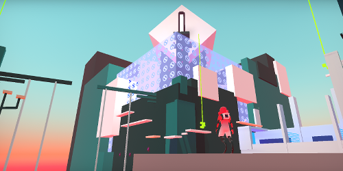
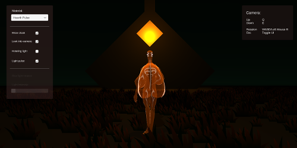
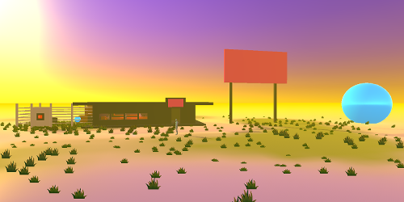
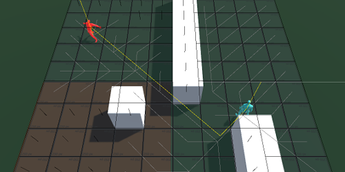

# Denis Huber - junior developer

## About me / O meni

Hi! My name is Denis Huber and I'm a recent graduate from the University of Organization and Informatics in Varaždin, Croatia. Below are some of the projects I've worked on in my free time. I've mostly been working with Unity and C# but I'm hoping to branch out soon!

\-

Pozdrav! Moje ime je Denis Huber i nedavno sam diplomirao na Fakultetu Organizacije i Informatike u Varaždinu. U nastavku su navedeni neki od projekata na kojima sam uglavnom radio u svoje slobodno vrijeme. Koristio sam Unity i C#, ali se nadam proširiti svoje znanje sa novim tehnologijama.

---

## Unity projects / Unity projekti

### Run! Elo! Run!

This project is a 3d platformer in which the player collects a set number of cubes until they unlock the exit. To do that, they will have to jump, dash and wallrun their way across a number of obstacles! The game contains a main menu and two different levels.

\-

Ovaj projekt je trodimenzionalni platformer u kojem igrač manevrira razinom kako bi sakupio kocke i otključao vrata za slijedeću razinu. U tome mu pomaže skakanje, nalet i trčanje po zidu. Igra se sastoji od glavnog izbornika i dvije razine.

[Link to Github repo](huber96.github.io)

---

### Tender's hearth

A simple scene setup to showcase one of six different shaders.

\-

Jednostavna scena namještena tako da najbolje pokazuje jednog od šest različitih shadera.

[Link to Link to Github repo](huber96.github.io)

---

### Orb adventure

This project is the first iteration of an adventure game, it features fixed camera angles, tank controls and simple dialogue cutscenes. The player must interact with people or objects around the scene to fix their spaceship. 

\-

Ovaj projekt je prva iteracija avanturističke igre, sadrži fiksne uglove, tenk kontrole i jednostavne scene dijaloga. Igrač istražuje likove i okolinu kako bi popravio svoj svemirski brod.

[Link to Github repo](huber96.github.io)

---

### Pathfinding examples

This project is an attempt at implementing the basics of a strategy game. For the moment, it contains: a grid, full camera system, simple grid-based movement and pathfinding (BFS or Dijkstra).

\-

Projekt je pokušaj izrade osnova za stratešku igru. Trenutačno sadrži: mrežu, potpuno izveden kamera sustav, kretanje bazirano na mreži i pathfinding algoritme poput BFS i Dijkstre.

[Link to Github repo](huber96.github.io)
